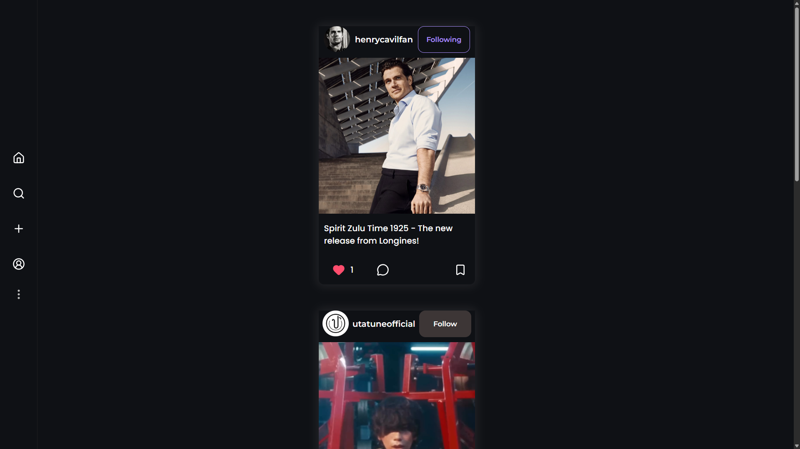
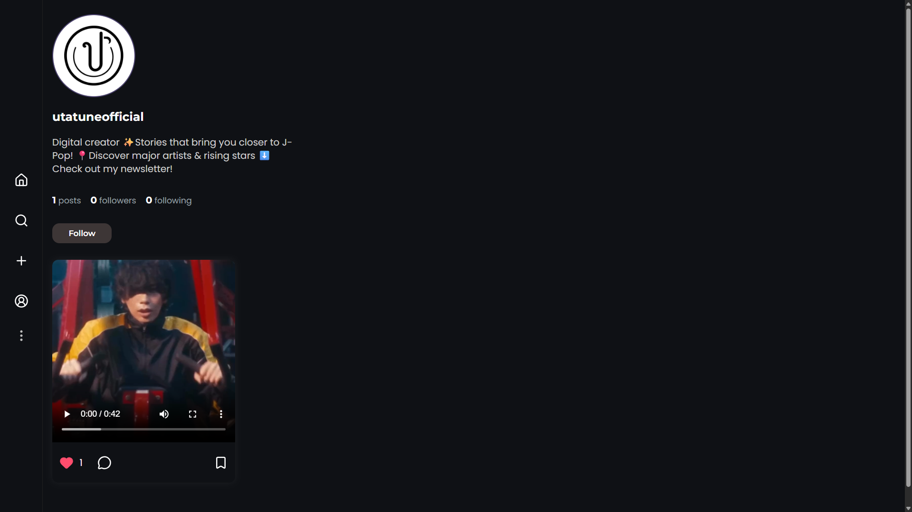
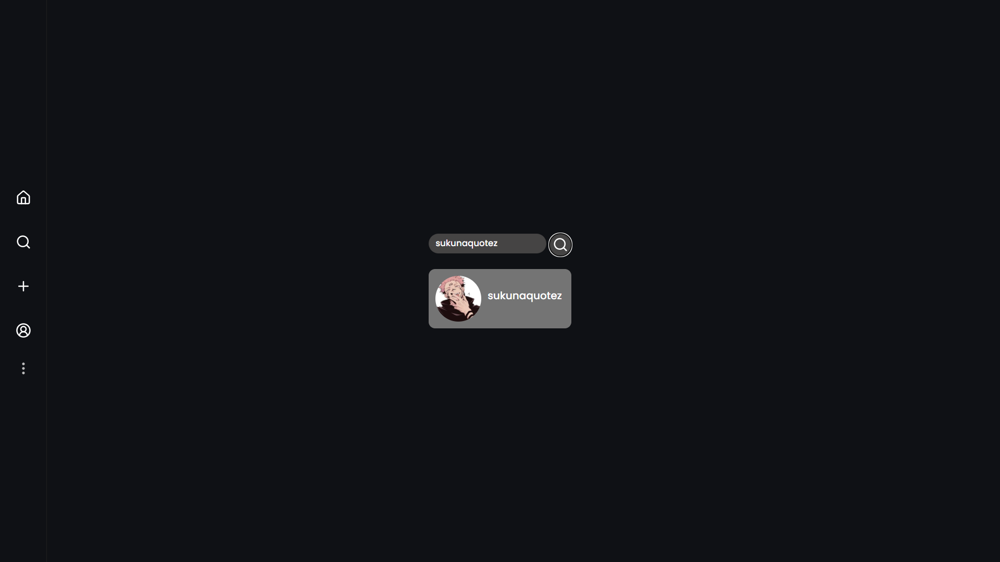

# 📸 Social Media App (Instagram Clone)

A full-stack social media web application built using the MERN stack.  
This app allows users to connect, share posts, and interact with each other in real-time experience.

---

## 🚀 Features

- 🔐 Authentication (JWT-based)
  - Sign up, Login, Logout

- 👤 User Profile
  - View your own profile
  - View other users' profiles
  - Update profile picture and bio

- 📸 Posts
  - Create posts (Image or Video)
  - Like posts
  - Comment on posts
  - Save posts

- 🔍 Search
  - Search users by username

- 🤝 Social Features
  - Follow / Unfollow users

- ♾️ Infinite Scroll
  - Smooth loading of posts on homepage

---

## 🛠️ Tech Stack

### Frontend

- React.js
- CSS

### Backend

- Node.js
- Express.js

### Database

- MongoDB (using MongoDB Compass)

### Authentication

- JSON Web Tokens (JWT)

---

## 📁 Project Structure

/Frontend -> React frontend
/Backend -> Express backend
/models -> Mongoose models
/routes -> API routes
/controllers -> Business logic

## ⚙️ Installation & Setup

### 1. Clone the repository

```bash
git clone https://github.com/Manojbhamare976/Social-Media-App.git
cd Social-Media-App
```

### 2. Setup Backend

cd Backend

npm install

Create a `.env` file in `/Backend`:

PORT=5000
MONGO_URI=your_mongodb_connection
JWT_SECRET=your_secret_key

Run backend:

---

### 3. Setup Frontend

cd Frontend
npm install
npm run dev

---

## 📷 Screenshots

<p align="center">
  
  
  
  
</p>

## 🎥 Demo Video

👉 (video link will be added soon)

## 🌐 Deployment

> 🚧 Not deployed yet  
> Live link will be added soon.

---

## 📌 Future Improvements

- Real-time notifications
- Story feature
- Multiple media upload
- Chat system

---

## 🙌 Author

- Manoj Bhamare

---

## ⭐ Show your support

If you like this project, give it a ⭐ on GitHub!
